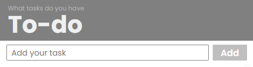

# Todo-App

A lightweight task manager built with HTML, CSS, and vanilla JavaScript for adding, editing, deleting, completing and reordering tasks. Tasks are saved in `localStorage`, so your list stays available after you refresh the page.

**Link:** [todo-reedwebdev.netlify.app](https://todo-reedwebdev.netlify.app/)

## ✅ Features

- Add, edit, and delete tasks
- Mark tasks as completed
- Reorder tasks with drag and drop
- Persist tasks in `localStorage`

## 🚀 Getting Started

### Run locally

1. Clone the repository.
2. Open `index.html` in your browser.

### Development

- No build tools are required.
- Modify the HTML, CSS, or JavaScript files.
- Refresh the browser to see updates.

## 📁 Project Structure

- `index.html` — application entry point
- `style.css` — styles for the app interface
- `src/script.js` — main application logic and event handling
- `src/task.js` — task creation, editing, deletion, and reordering behavior
- `src/tasks.js` — task storage and rendering utilities
- `utils/moveItem.js` — helper for task reordering
- `utils/drag.js` — helpers for drag-and-drop reordering

## 💡 Notes

- Editing multiple tasks at the same time should not be allowed; this still needs to be fixed.

## 🔧 Future Improvements

- Due dates and reminders
- Categories and tags
- Task filtering by category or due date
- Subtasks support
- Backend sync and authentication

## 📌 Contribution

Contributions are welcome. Open issues or submit pull requests for improvements.

## Reminder:

Update `style.css` with proper attributes. Create a naming guideline for styles and query selectors, using classes for styling and ids or dataset attributes for querying.
